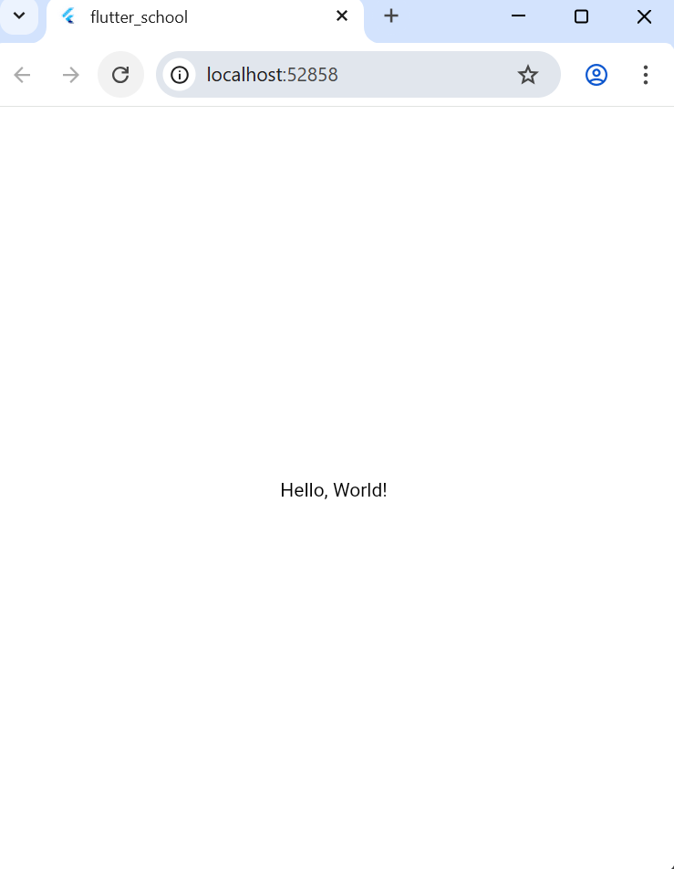
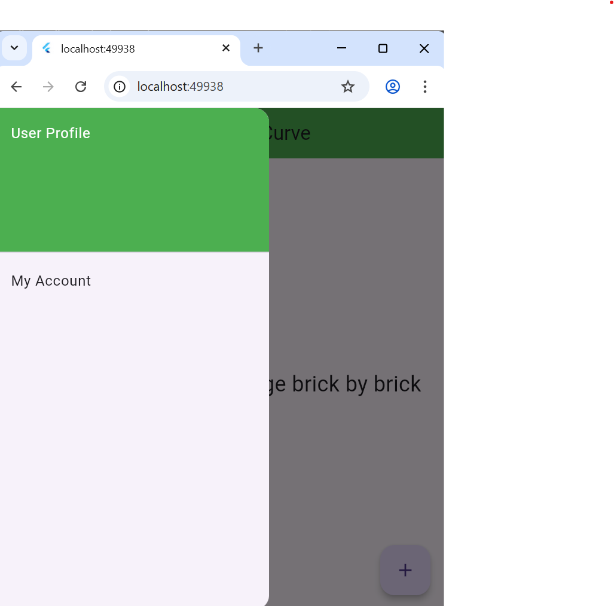
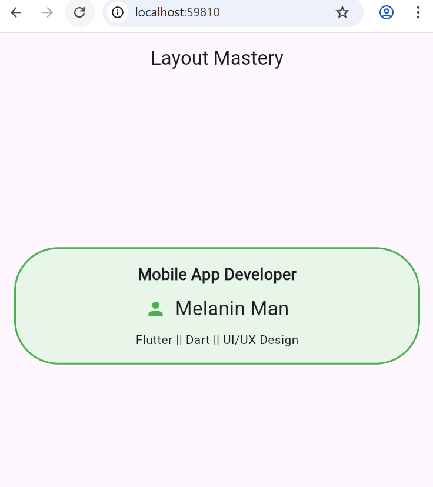
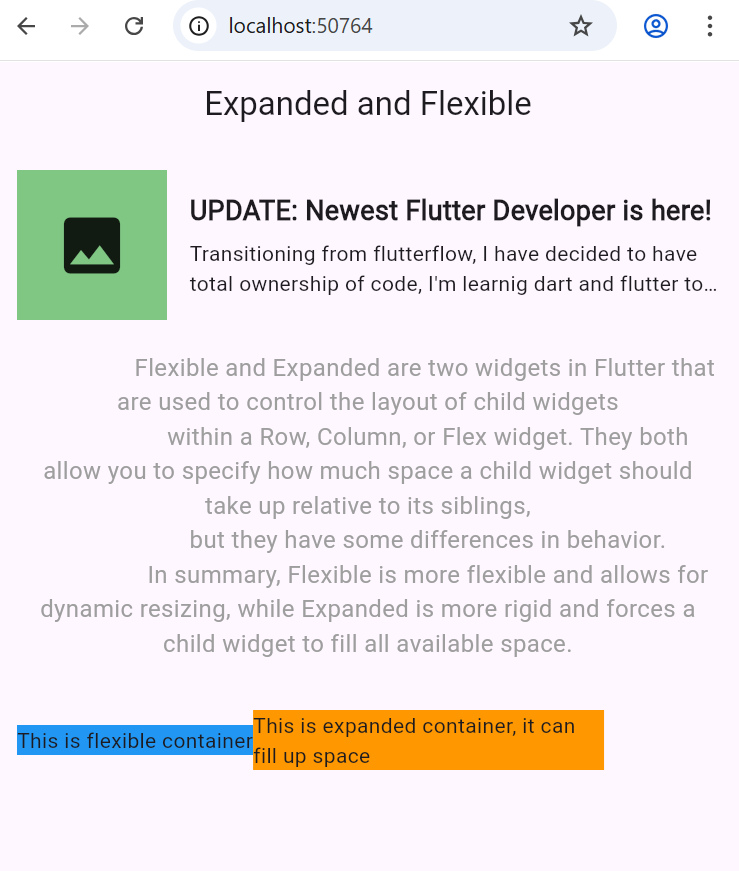
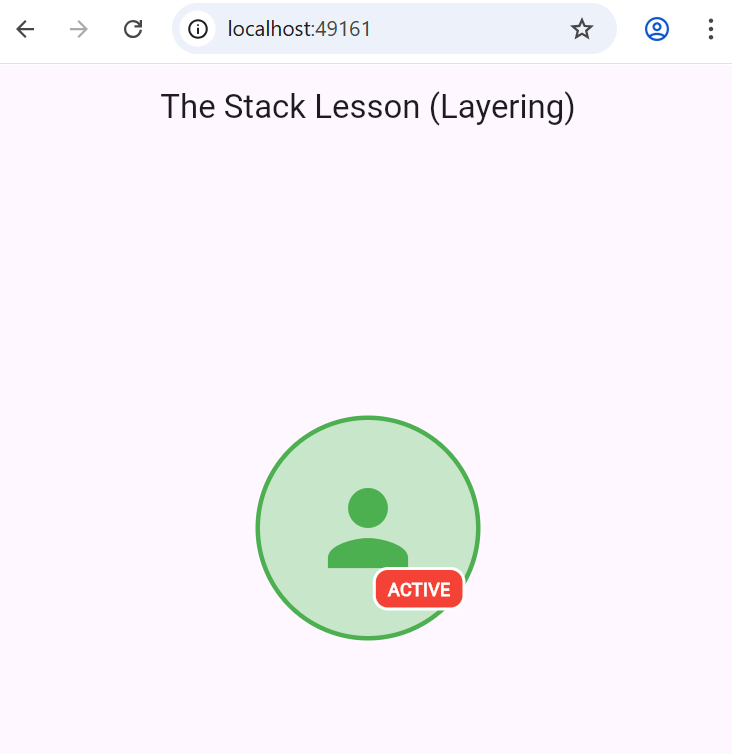
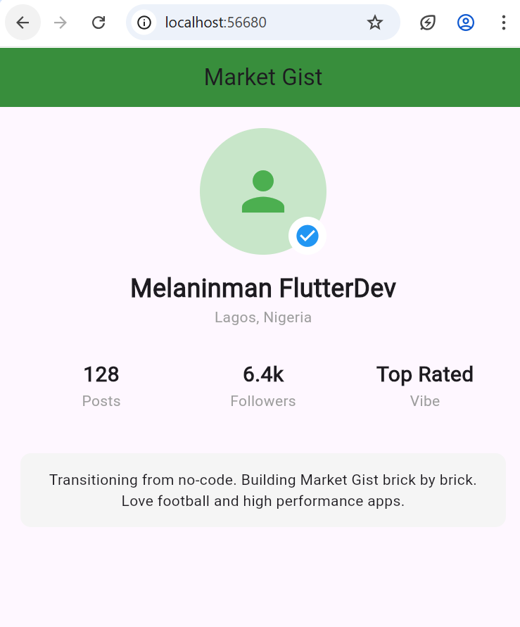

# flutter_school

This is my personal journey from a Dart foundation to Flutter Mastery.

## Phase 1: Foundations

### 01. Hello World (Completed ✅)
- **Concept:** Root widgets and the Widget Tree.
- **Screenshot:** 

### 02. The Scaffold (Completed ✅)
- **Concept:** Using `Scaffold` for app structure (AppBar, Drawer, FAB).
- **Key Insight:** The Scaffold acts as a layout container that provides slots for standard UI elements.
- **Screenshot:** 

### 03. Layout Basics (Completed ✅)
- **Concept:** Mastering the "Big Three" of layout: `Container`, `Row`, and `Column`.
- **Key Learnings:**
    - **Container:** The "Box" widget used for padding, margins, and decoration like rounded corners.
    - **Column:** Arranges widgets vertically (Top-to-Bottom).
    - **Row:** Arranges widgets horizontally (Left-to-Right).
    - **MainAxisAlignment:** Controls how space is distributed (e.g., `spaceBetween` pushes items to the edges).
    - **Screenshot:** 

### 04. Expanded & Flexible (Completed ✅)
- **Concept:** Managing screen space and preventing overflow errors.
- **Key Learnings:**
    - **Overflow:** The "Caution Tape" error happens when content is wider than the screen.
    - **Expanded:** Forces a child to fill all remaining space in a Row/Column.
    - **Flexible:** Allows a child to be its natural size but prevents it from breaking the layout if space gets tight.
- **The Result:** Built a responsive News Tile and a layout comparison guide.
- **Screenshot:** 

### 05. The Stack (Completed ✅)
- **Concept:** Layering widgets on top of each other.
- **Key Learnings:**
    - **Stack Order:** The last item in the code is the top-most item on the screen.
    - **Positioned:** The "specialist" widget used to pin children to exact coordinates inside a Stack.
    - **The Result:** Built a profile picture with a "ACTIVE" status badge floating on top.
- **Screenshot:** 

## 🏆 Phase 1 Capstone: Market Gist Profile
- **Objective:** Combine all foundational layout widgets into a single, responsive profile page.
- **Widgets Used:** Scaffold, Stack, Column, Row, Expanded, Container, CircleAvatar.
- **Key Victory:** Managed complex nesting and verified badge positioning using **Stack Alignment**.
- **Screenshot:** 

## Phase 2: States and Interactivity

### 06. State Basics
- **Concept:** Moving from Stateless to Stateful widgets.
- **Key Learning:** Using `setState()` to update the UI and adding conditional logic to prevent negative values.

### 07. Buttons and Feedback
- **Concept:** Communicating with the user after an action.
- **Key Learnings:**
    - **SnackBar:** Floating alerts for quick success/error messages.
    - **AlertDialog:** Modal pop-ups for critical confirmation steps.
    - **Navigator.pop:** Closing the top-most layer (dialog) to return to the main screen.