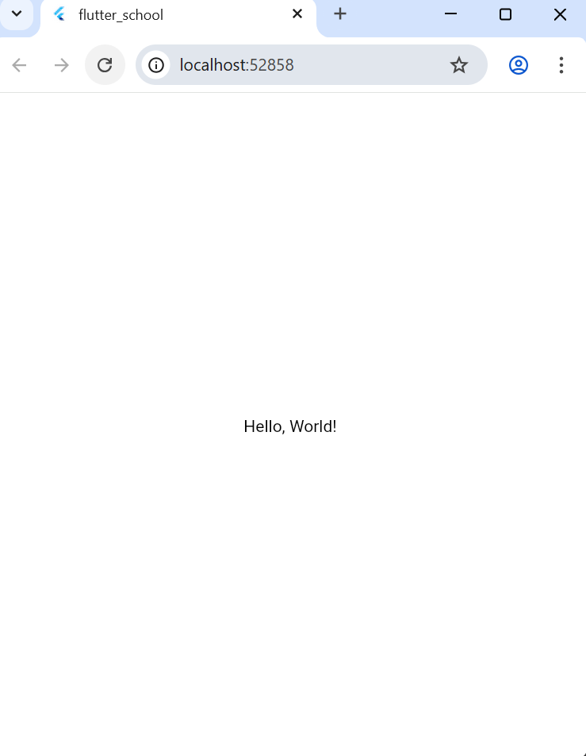
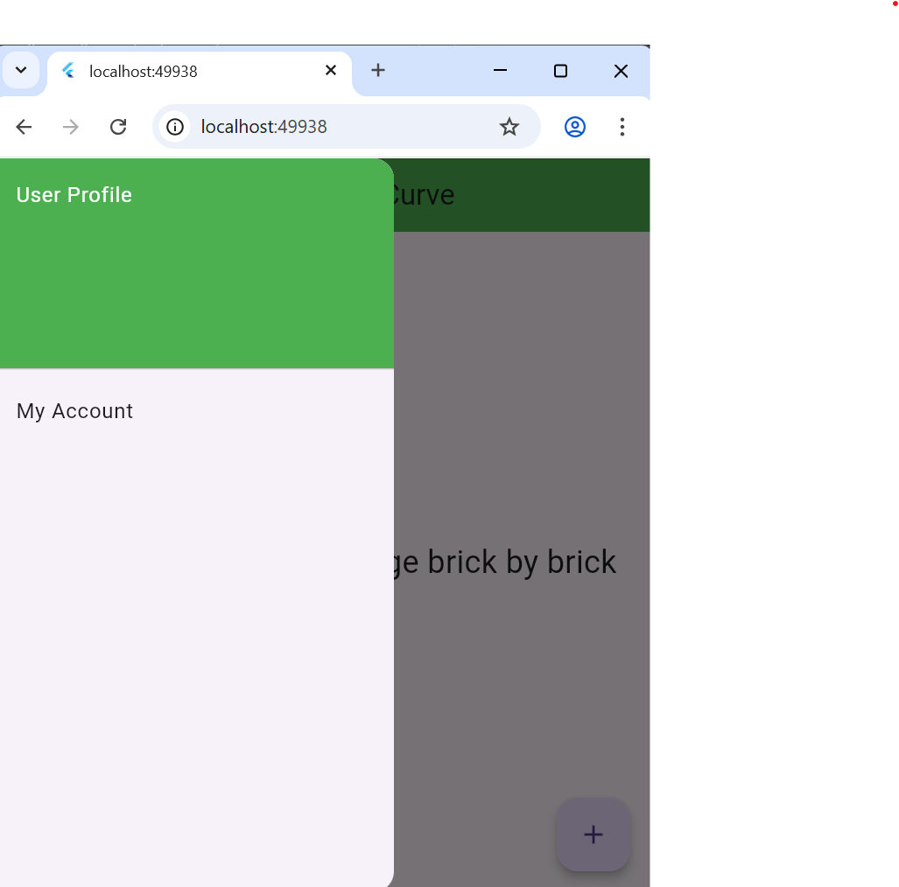
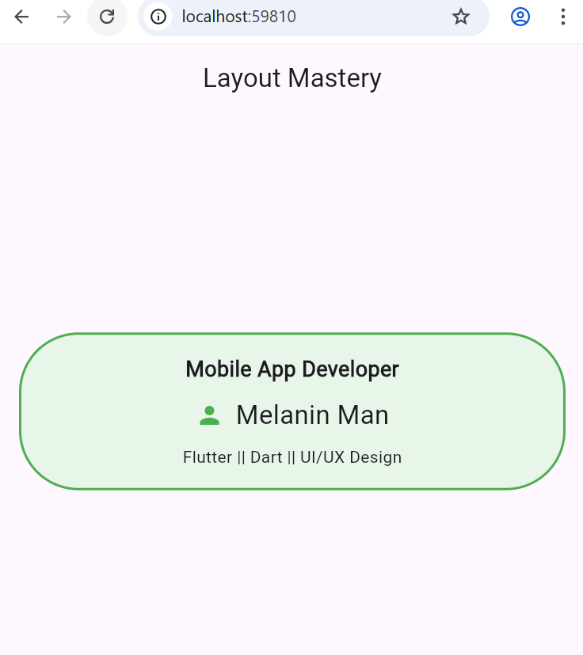
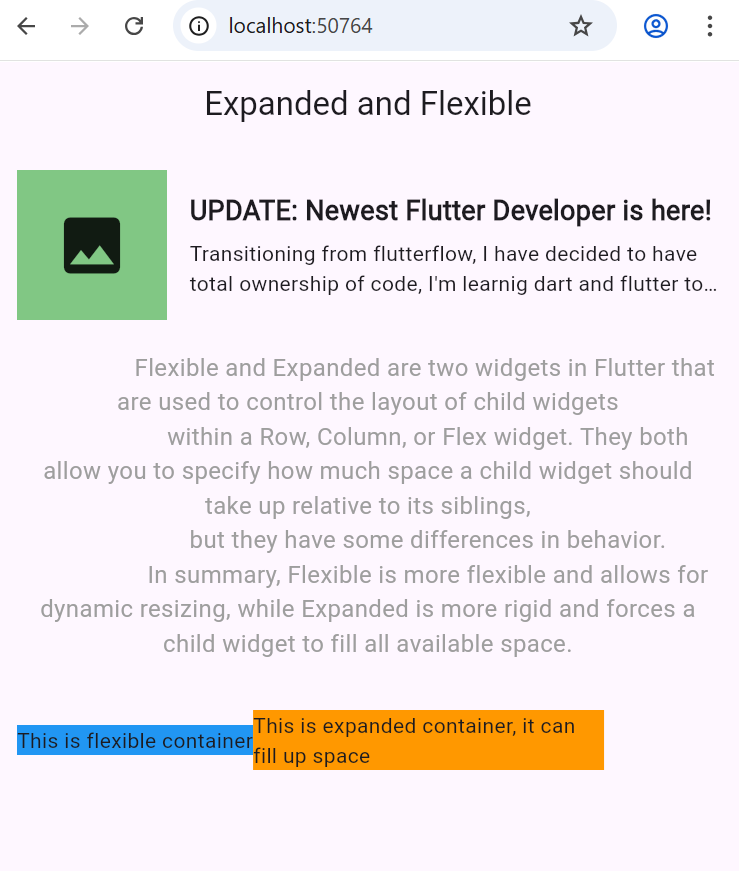
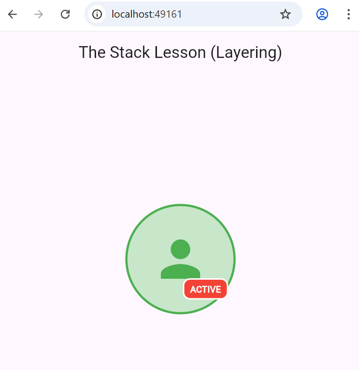
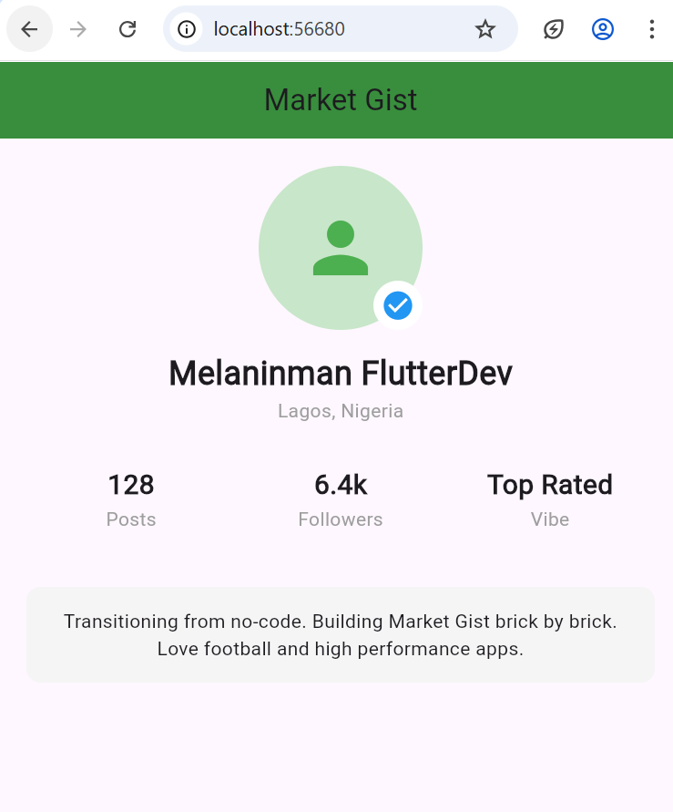

# flutter_school

This is my personal journey from a Dart foundation to Flutter Mastery.

## Phase 1: Foundations

### 01. Hello World (Completed ✅)
- **Concept:** Root widgets and the Widget Tree.
- **Screenshot:** 

### 02. The Scaffold (Completed ✅)
- **Concept:** Using `Scaffold` for app structure (AppBar, Drawer, FAB).
- **Key Insight:** The Scaffold acts as a layout container that provides slots for standard UI elements.
- **Screenshot:** 

### 03. Layout Basics (Completed ✅)
- **Concept:** Mastering the "Big Three" of layout: `Container`, `Row`, and `Column`.
- **Key Learnings:**
    - **Container:** The "Box" widget used for padding, margins, and decoration like rounded corners.
    - **Column:** Arranges widgets vertically (Top-to-Bottom).
    - **Row:** Arranges widgets horizontally (Left-to-Right).
    - **MainAxisAlignment:** Controls how space is distributed (e.g., `spaceBetween` pushes items to the edges).
    - **Screenshot:** 

### 04. Expanded & Flexible (Completed ✅)
- **Concept:** Managing screen space and preventing overflow errors.
- **Key Learnings:**
    - **Overflow:** The "Caution Tape" error happens when content is wider than the screen.
    - **Expanded:** Forces a child to fill all remaining space in a Row/Column.
    - **Flexible:** Allows a child to be its natural size but prevents it from breaking the layout if space gets tight.
- **The Result:** Built a responsive News Tile and a layout comparison guide.
- **Screenshot:** 

### 05. The Stack (Completed ✅)
- **Concept:** Layering widgets on top of each other.
- **Key Learnings:**
    - **Stack Order:** The last item in the code is the top-most item on the screen.
    - **Positioned:** The "specialist" widget used to pin children to exact coordinates inside a Stack.
    - **The Result:** Built a profile picture with a "ACTIVE" status badge floating on top.
- **Screenshot:** 

## 🏆 Phase 1 Capstone: Market Gist Profile
- **Objective:** Combine all foundational layout widgets into a single, responsive profile page.
- **Widgets Used:** Scaffold, Stack, Column, Row, Expanded, Container, CircleAvatar.
- **Key Victory:** Managed complex nesting and verified badge positioning using **Stack Alignment**.
- **Screenshot:** 

## Phase 2: States and Interactivity

### 06. State Basics
- **Concept:** Moving from Stateless to Stateful widgets.
- **Key Learning:** Using `setState()` to update the UI and adding conditional logic to prevent negative values.

### 07. Buttons and Feedback
- **Concept:** Communicating with the user after an action.
- **Key Learnings:**
    - **SnackBar:** Floating alerts for quick success/error messages.
    - **AlertDialog:** Modal pop-ups for critical confirmation steps.
    - **Navigator.pop:** Closing the top-most layer (dialog) to return to the main screen.

### 08. Gestures & Custom Touch (Phase 2 - Step 3.5)
- **Concept:** Making non-button widgets (Containers, Icons) interactive.
- **Key Learnings:**
    - **InkWell:** Added for the Material "ripple" effect to give users visual confirmation.
    - **GestureDetector:** Explored for advanced invisible touch handling.
    - **UX Best Practice:** Prioritizing visual feedback to prevent multiple accidental taps.

### 09. Logic & Functions (Phase 2 - Step 4)
- **Concept:** Separating business logic (calculations) from UI code.
- **Key Learnings:**
    - **Data Sanitization:** Using `double.tryParse` to prevent crashes from invalid user input.
    - **Conditional Logic:** Implementing a dynamic discount system based on price thresholds.
    - **UI Formatting:** Using `toStringAsFixed` for professional currency display.

## 🏆 Phase 2 Capstone: Market Gist Entry Form
A comprehensive form that captures market data and performs live calculations.
- **Features:** - Real-time total price calculation (Price × Quantity).
  - Dynamic UI updates via `onChanged` triggers.
  - Two-step confirmation process (Dialog -> Snackbar).
  - Full form reset upon successful save.

## 🏗️ Phase 3 - Architecture, Navigation & Data Persistence

This phase focuses on application architecture, efficient data rendering, and cross-screen state synchronization.

### 1. Data Modeling & Type Safety
- Encapsulation: Transitioned from primitive data types to a structured MarketItem model to ensure data consistency.
- Immutability: Leveraged final fields within the model to promote predictable state transitions.
- Object-Oriented Design: Implemented custom constructors to enforce required parameters, preventing null-pointer exceptions during data transfer.
### 2. Advanced Layouts & High-Performance Lists
- ListView.builder: Optimized memory usage by implementing lazy-loading for large datasets, ensuring smooth 60 FPS scrolling.
- Conditional Rendering: Developed "Empty State" UI logic to enhance UX when datasets are uninitialized.
- Component Architecture: Utilized ListTile and CircleAvatar for standard material design compliance. 
### 3. Imperative Routing & Parameter Passing
- Navigator API: Implemented explicit routing using Navigator.push and MaterialPageRoute.
- Constructor Injection: Developed a pattern for passing complex objects between route segments, enabling seamless data flow from the "Entry" module to the "History" module.
- Lifecycle Management: Utilized initState() for data synchronization, ensuring incoming parameters are parsed before the initial build cycle.
### 4. Data Integrity & Input Validation
- Guard Clauses: Implemented logic gates to prevent invalid or empty state updates.
- Real-Time Reactive Validation: Used onChanged callbacks to provide immediate UI feedback via errorText attributes.
- Input Sanitization: Utilized double.tryParse and .trim() methods to sanitize raw user input and prevent runtime type-mismatch crashes.
- Resource Management: Implemented the dispose() pattern for TextEditingControllers to prevent memory leaks.
